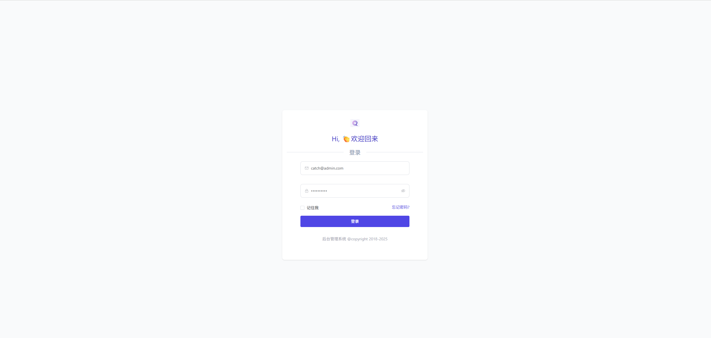
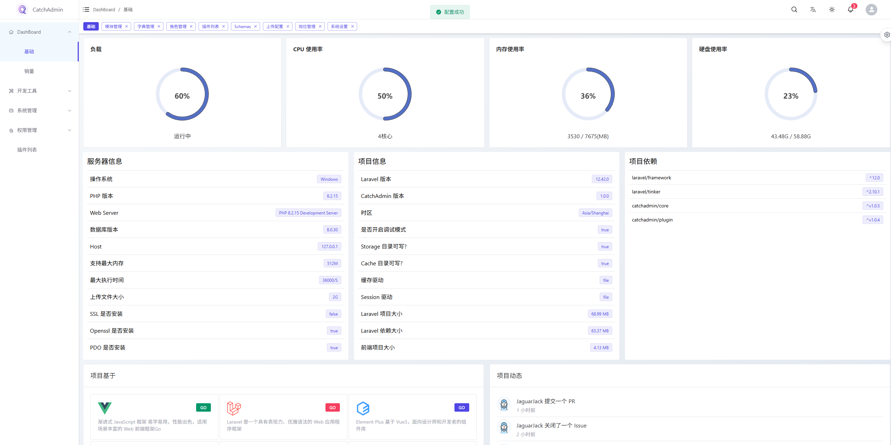
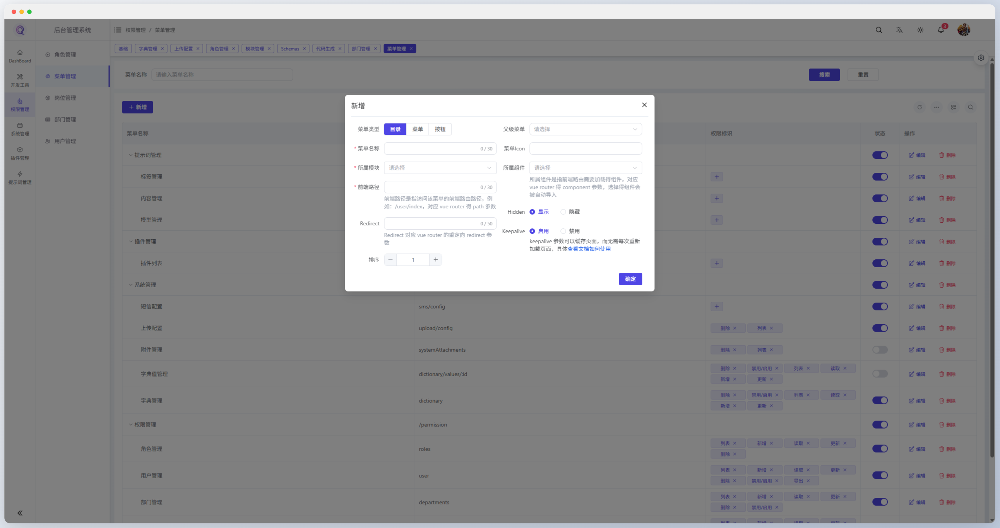
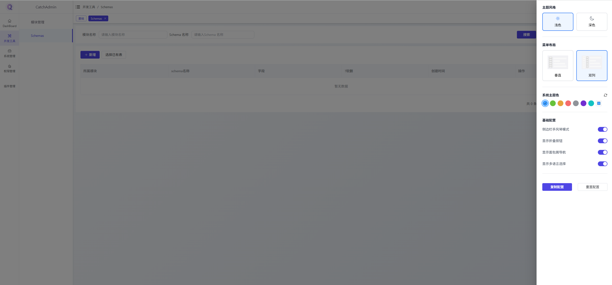
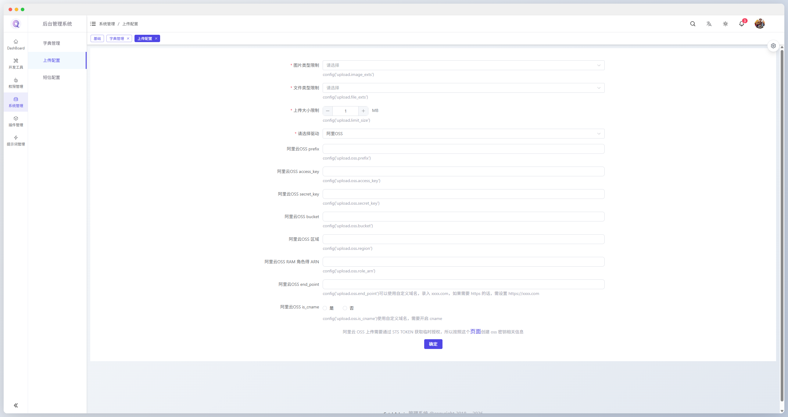
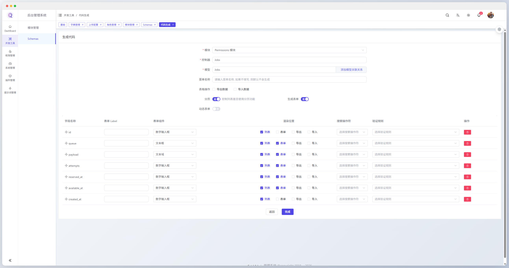
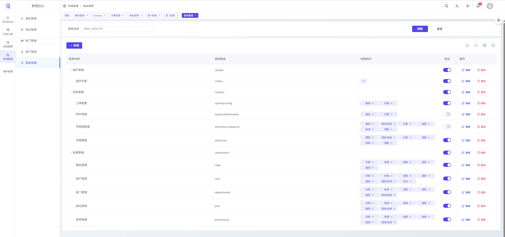
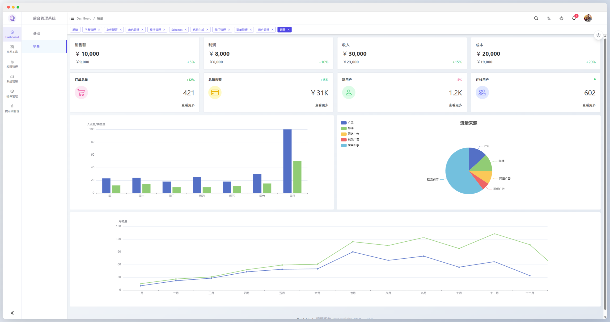

<br />
<div align="center">
    
    <h1 style="font-size:36px;font-weight:600;margin:0 0 6px 0;
  background:linear-gradient(
    120deg,
    #42a5f5 0%,
    #6a8dff 25%,
    #42a5f5 50%,
    #5c6bc0 75%,
    #42a5f5 100%
  );
  color:transparent;
  background-clip:text;
  -webkit-background-clip:text;
">CatchAdmin</h1>
    <p style="font-size:17px;color:#6a8bad;margin-bottom:10px;">
        Build a full-featured admin system with a powerful built-in permission system in just 5 minutes
    </p>
    <a href="https://catchadmin.com" target="_blank">Official Site</a> |
    <a href="https://v5.catchadmin.com" target="_blank">Live Demo</a> |
    <a href="https://catchadmin.vip/forum" target="_blank">Community</a> |
    <a href="https://catchadmin.vip/plugins" target="_blank">Plugins</a> |
    <a href="https://doc.catchadmin.com/" target="_blank">Documentation</a> |
    <a href="https://gitee.com/catchadmin/catchAdmin" target="_blank">Gitee</a> |
    <a href="https://github.com/JaguarJack/catch-admin" target="_blank">GitHub</a>
</div>
<br />
<p align="center">
    <a href="https://php.net/" target="_blank">
        
    </a>
    <a href="https://laravel.com/" target="_blank">
        
    </a>
    <a href="https://vuejs.org/" target="_blank">
        
    </a>
    <a href="https://element-plus.org/" target="_blank">
      
    </a>
    <a href="https://vitejs.dev/" target="_blank">
        
    </a>
    <a href="https://httpd.apache.org/" target="_blank">
      
    </a>
</p>

## Introduction

`CatchAdmin` is an open-source PHP admin system built on top of [Laravel 12.x](https://laravel.com) and [Vue 3](https://vuejs.org/), using a fully decoupled frontend-backend architecture. It is designed for enterprise-level backend scenarios and provides a modular, extensible framework with rich features out of the box.

The system includes Token-based authentication, permission management (menu, button, and data-level permissions), dynamic routing, dynamic tables, pagination abstraction, resource authorization, upload/download support, a code generator (with one-click import/export), recycle bin, attachment management, and more—covering common needs from security and access control to high-efficiency development.

From an architectural perspective, `Laravel` is used strictly as an `API` service layer, minimizing coupling between business modules. Each module is fully independent, with its own controllers, routes, models, and database tables, enabling modular development, on-demand loading, and independent evolution. This significantly reduces development complexity while improving maintainability and iteration speed. In addition, many common utilities are encapsulated (such as unified responses, exception handling, pagination, and resource wrappers), allowing developers to focus more on business logic.

Based on `CatchAdmin`, you can quickly build systems such as `CMS`, `CRM`, and `OA`, and continuously extend business modules on top of a stable infrastructure to meet the needs of teams of different sizes.

[Chinese](./README.md) | [English](./README-en.md)

## Features

- ☑️ **User Management**: Create, edit, delete, disable users, reset passwords, and manage profiles; different users can see different dashboards and features
- ☑️ **Department Management**: Multi-level organization structure (company/department/team) with tree-based management and personnel assignment
- ☑️ **Position Management**: Unified management of positions (roles/jobs), supporting primary and multiple positions per user
- ☑️ **Role Management**: Tree-based role system supporting menu permissions, button-level permissions, and data access control
- ☑️ **Menu Management**: Visual configuration of menus, routes, and buttons with sorting, hierarchy, and visibility control
- ☑️ **Dictionary Management**: Centralized management of enums, statuses, and common constants with grouping and enable/disable support
- ☑️ **System Configuration**: Centralized configuration of system parameters with dynamic loading and fast effect
- ☑️ **Operation Logs**: Records key user operations with multi-dimensional querying for auditing and troubleshooting
- ☑️ **Login Logs**: Tracks login history (time/IP/device, depending on implementation) for security analysis
- ☑️ **File Upload**: Unified upload mechanism supporting `Local`, `Qiniu`, `Aliyun OSS`, and `Tencent COS`
- ☑️ **Attachment Management**: Centralized management of uploaded files and images with search, preview, and cleanup
- ☑️ **Database Maintenance**: Table optimization, fragment cleanup, and data recycle/destroy management
- ☑️ **Code Generator**: One-click generation of backend (`PHP`), frontend (`Vue`), and database migration code
- ☑️ **Vue Instant Rendering**: Supports instant Vue rendering without build steps, accelerating development and debugging
- ☑️ **Plugin System**: Plugins are Composer packages, deeply integrated with the Composer ecosystem for modular extension
    - Docs: [CatchAdmin Plugin Quick Start](https://doc.catchadmin.com/docs/5.0/plugin/quickstart)

## Frontend Project

[catchadmin-vue](https://gitee.com/catchadmin/catch-admin-vue)

## Live Demo

[Demo Site](https://v5.catchadmin.com)

- Account: `catch@admin.com`
- Password: `catchadmin`

## Discussion

- You can submit issues following the issue template
- Join the community via WeChat (add and note `catchadmin`)


## Preview

|                                                |                                                     |
|------------------------------------------------|-----------------------------------------------------|
|       |       |
|  |          |
|      |  |
|        |         |

## Video Tutorials

- [CatchAdmin Installation](https://www.bilibili.com/video/BV1eY411v71J/)
- [CatchAdmin – Module Creation](https://www.bilibili.com/video/BV1jP41127aW/)
- [CatchAdmin – Rapid Development](https://www.bilibili.com/video/BV1Qh4y1J7eB/)

## Related Resources

- [Laravel Chinese Documentation](https://laravel-docs.catchadmin.com/)
- [Laravel Free Beginner Tutorial](https://laravel-study.catchadmin.com)
- [Laravel Livewire Chinese Documentation](https://laravel-livewire.catchadmin.com/)

## Code Standards

### PHP

Format code using Laravel Pint:

```shell
composer format
```

Static analysis using PHPStan
```shell
composer analyse
```
## Acknowledgements 🙏
- [Laravel](https://laravel.com)
- [Vue](https://cn.vuejs.org/)
- [ElementPlus](https://element-plus.org)
- [VitePress](https://vitepress.dev/zh/)
