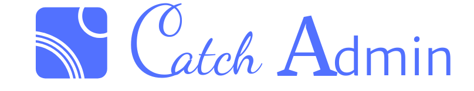

<a href="https://gitee.com/jaguarjack/catchAdmin" target="_blank">
< img src="https://svg.hamm.cn/gitee.svg?type=star&user=jaguarjack&project=catchAdmin"/>
</a >
<a href="https://gitee.com/jaguarjack/catchAdmin" target="_blank">
< img src="https://svg.hamm.cn/gitee.svg?type=fork&user=jaguarjack&project=catchAdmin"/>
</a >
< img src="https://svg.hamm.cn/badge.svg?key=Base&value=ThinkPHP6"/>
< img src="https://svg.hamm.cn/badge.svg?key=Data&value=MySQL5.5"/>
< img src="https://svg.hamm.cn/badge.svg?key=Runtime&value=PHP7.1"/>
< img src="https://svg.hamm.cn/badge.svg?key=License&value=Apache-2.0"/>

## CatchAdmin
- 该项目采用`前后端分离`，所以 PHP 作为 API 开发，vue 作为后台开发
- 两个项目是分开的，单独部署。
## 这是 vue 分支 开发中
- [vue 项目地址](https://github.com/yanwenwu/catch-admin-vue)

## 项目地址
- [github地址](https://github.com/yanwenwu/catch-admin)
- [gitee地址](https://gitee.com/jaguarjack/catchAdmin)

### 环境要求
- php7.1+ (需以下扩展)
    - mbstring
    - json
    - openssl
    - xml
    - pdo
- nginx
- mysql

### install
- curl -sS https://install.phpcomposer.com/installer | php
- composer config -g repo.packagist composer https://mirrors.aliyun.com/composer/
- composer install
- php think catch:install 

## 体验地址

[体验地址](http://vue.catchadmin.com)
- 账号: test@catch.com 
- 密码: 123456

[catchadmin 文档地址](http://doc.catchadmin.com)

[catchadmin 接口文档地址](http://apidoc.catchadmin.com)
- 账号：test@catch.com
- 密码：123456
请大家不要随意添加数据，因为没有意义，只看 `catchadmin` 的文档就可以了。
如果有太多脏数据的话，我会关闭该账号。

### 系列文章
如果是刚开始使用 thinkphp6, 以下文章可能会对你有些许帮助，文章基于 RC3 版本。整体架构是不变的。
- [Tp6 启动分析](https://www.kancloud.cn/akasishikelu/thinkphp6/1129385)
- [Tp6 Request 解析](https://www.kancloud.cn/akasishikelu/thinkphp6/1134496)
- [TP6 应用初始化](https://www.kancloud.cn/akasishikelu/thinkphp6/1130427)
- [Tp6 中间件分析](https://www.kancloud.cn/akasishikelu/thinkphp6/1136616)
- [Tp6 请求流程](https://www.kancloud.cn/akasishikelu/thinkphp6/1136608)

### Talking
- [论坛讨论](http://bbs.catchadmin.com)
- 可以提 ISSUE，请按照 issue 模板提问
- 欢迎进入 Q 群 `302266230` 讨论以及反馈一些问题。

仅供学习

